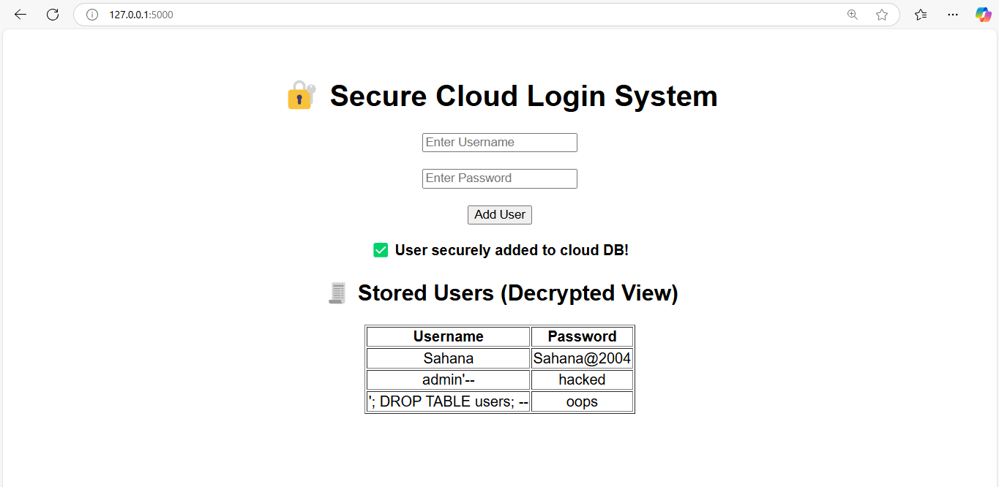

# 🔐 Secure Cloud Login System

A professional Flask-based web application that **encrypts user credentials** and **safely stores them in a cloud database**, while actively detecting and preventing **SQL Injection Attacks**.

---

## 🚀 Features
- 🔑 **Secure User Login Form**
- 🔐 **AES Encryption** of passwords
- ☁️ **Cloud Database Storage** with SQLite
- 🛡️ **SQL Injection Prevention**
- 📜 **Decrypted View for Admins**
- 💻 Built with **Flask + Python + SQLite**

---

## 📸 Screenshots
### ✅ Secure UI + Attack-Prevention Demo


> Shows login form, confirmation message, and safe storage of even SQL injection attempts as plain text — proving **protection**!

---

## 🧠 Tech Stack

| Technology  | Purpose             |
|-------------|---------------------|
| Python      | Core Programming    |
| Flask       | Web Framework       |
| SQLite      | Cloud Database      |
| Cryptography| AES Encryption      |
| HTML + CSS  | Frontend (UI)       |

---

## 🚀 How to Run

1. Clone the repo
   ```bash
   git clone https://github.com/sahana-portfolio/CodeAlpha_SQL_Injection_Prevention.git
